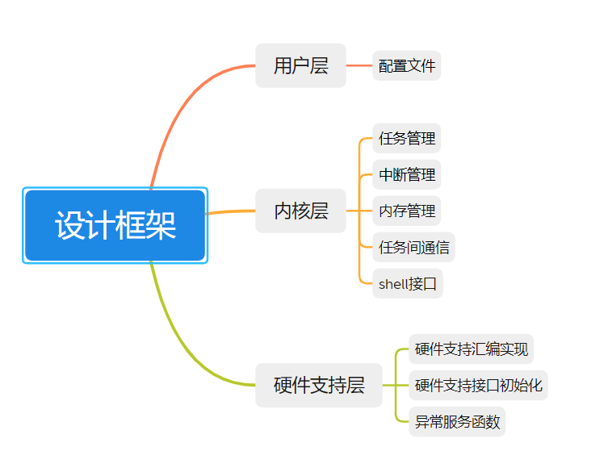

# MOS

### 1 简介

**介绍：**一款开源的实时操作系统MicroOS，支持 ARM 系列 M3 内核架构和 M4 内核架构（暂不支持FPU），基础框架已完成**任务调度、中断管理以及内存管理以及任务间通信(同步信号量与互斥信号量)，同时支持部分shell功能**，已经在STM32F103芯片上移植并且顺利运行

**特性：** 目前支持静态任务创建，动态任务创建，多优先级，支持时间片轮转调度，同步信号量，并持续开发中

**log：**

1. 20211007：添加shell的stm32实现demo
2. 20211008：适配stm32F103RCT6（mini板）替换FreeRTOS，移植LCD demo，驱动源码来自正点原子例程
   - FreeRTOS实验14-4 FreeRTOS互斥信号量操作实验

### 2 MOS结构

#### 2.1 MOS架构图

1. 红色为目前正在设计编写的部分


#### 2.2 MOS文件框架



#### 2.3 MOS设计框架


### 3 源码目录

1. **mos_user_config.h  用户配置文件**
2. **core 内核文件**
   - include：头文件
     - mos_init.h
     - mos_list.h 链表实现
     - mos_misc.h
     - mos_sys.h
     - mos_task.h
     - mos_tick.h
     - mos_heap.h
     - mos_misc.h
     - mos_shell.h
   - mos_init.c       内核初始化
   - mos_misc.c    内核杂项（字符处理等）
   - mos_sys.c       系统支持(临界区等)
   - mos_task.c     任务与调度（任务创建，延时，调度器开启等）
   - mos_tick.c      定时器
   - mos_heap.c   动态内存管理
   - mos_misc.c   杂项（字符串处理，printf重映射）
   - mos_shell.c   shell功能 
3. **ports  硬件接口文件**
   - mos_hw.c 	系统硬件支持（栈初始化等）
   - mos_hw.h 
   - mos_port_asm.s 系统软件支持，汇编实现（PendSV中断服务函数，SVC中断服务函数）
   - mos_port.c  系统软件支持（滴答定时间配置，滴答定时器中断等）
   - mos_port.h
   - mos_typedef.c  数据类型重定义

### 4 设计框架

> 设计框架按层分类，由三层组成，**用户层，内核层以及硬件支持层**

##### 4.1 用户层

1. config.h，可裁剪，配置相关需求

##### 4.2 内核层

1. 任务管理
   - 任务创建
   - 任务延时
   - 任务调度
   - 任务挂起与恢复
2. 中断管理
   - 开关中断
   - 中断嵌套管理
3. 内存管理
   - 动态内存管理
4. 任务间通信
   - 同步信号量
   - 互斥信号量
5. SHELL命令台

##### 4.3 硬件支持层

1. 硬件支持的汇编实现（临界区，任务切换的上下文保存部分）
2. 硬件支持的接口初始化（任务栈，定时器，shell硬件接口）
3. 异常服务函数

### 5 移植过程（STM32F103标准库）

#### 5.1 静态方法

##### 5.1.1 修改接口文件

1. 屏蔽标准库中断服务函数
   - SVC_Handler
   - PendSV_Handler
   - SysTick_Handler
2. 配置mos_user_config.h 
   - 设置CPU频率
   - 设置MOS时钟周期
   - **#define MOS_CONFIG_USE_DYNAMIC_HEAP		    (NO)**
3. 引入头文件 mos_init.h mos_task.h mos_port.h

##### 5.1.2任务创建

1. 设置系统中断优先级分组
2. 硬件初始化
3. 进入临界区
4. 内核初始化
5. 任务创建
   - 任务控制块指针
   - 任务入口函数
   - 任务优先级
   - 任务堆栈大小，单位为字
   - 任务栈起始地址
6. 退出临界区
7. 任务调度开启

#### 5.2 动态方法

##### 5.2.1 修改接口文件

1. 屏蔽标准库中断服务函数
   - SVC_Handler
   - PendSV_Handler
   - SysTick_Handler
2. 配置mos_user_config.h 
   - 设置CPU频率 MOS_CONFIG_CPU_FREQUENCY
   - 设置MOS时钟周期 MOS_CONFIG_TICK_PER_SECOND
   - **#define MOS_CONFIG_USE_DYNAMIC_HEAP		    (YES)**
   - 设置动态内存大小 MOS_CONFIG_HEAP_SIZE
   - 如果使用shell 和debug输出接口
     - **#define MOS_CONFIG_USE_SHELL                      (YES)**
     - **#define MOS_CONFIG_USE_DEBUG_PRINTF	 (YES)**
     - **#define MOS_SHELL_DEBUG_PORT                    (USART1)**   使用串口
3. 引入头文件 mos.h mos_init.h mos_task.h mos_port.h（mos_ipc.h）
4. 修改port.h文件
   - CPU_DATA CPU数据
5. 修改port.c文件
   - mos_port_output shell/debug输出接口
   - USART1_IRQHandler 串口1中断shell/debug输入接口)
   - mos_port_bsp_init 初始化shell接口

##### 5.2.2任务创建

1. 设置系统中断优先级分组
2. 硬件初始化
3. 进入临界区
4. 内核初始化
5. 任务创建：需要以下参数
   - 任务控制块指针
   - 任务入口函数
   - 任务优先级
   - 任务堆栈大小，单位为字
6. 退出临界区
7. 任务调度开启

### 6 其他

##### 6.1 shell指令集

```c
 //目前支持的指令集
 help: CMD Help Information
 ls  : Hardware And OS Information
       -task: OS TASK  Information
       -ipc : OS IPC   Information
       -heap: OS HEAP  Information
       -time: OS TIME  Information
```

